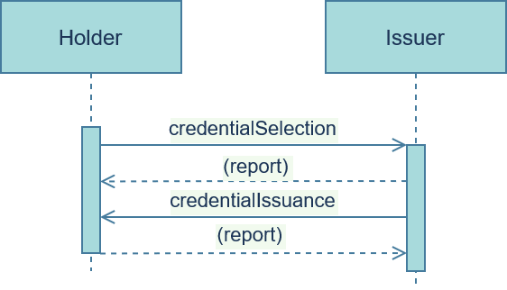

# credential-issuance
Creating an authenticated statement about a DID.

The Verifiable Credential (VC) issuance flow consists of a three step interaction process ([credential-options](i_credential-options.md), [credential-schema](i_credential-schema.md) & [credential-issuance](i_credential-issuance.md) between two parties, the <u>issuer</u> and the <u>holder</u>. This is the third interaction in this process. In this interaction, the <u>holder</u> asks the <u>issuer</u> for issuance of a specific VC.

### Roles
- **Issuer**: Agent who offers and issues one or more Verifiable Credentials
- **Holder**: Agent who selects and receives one or more Verifiable Credentials

### Flow



### Messages

#### credentialSelection
The <u>holder</u> sends a message containing a list of selected credentials.

###### Layout

```JSON
credentialSelection: {
    "context", // REQUIRED!
    "thread", // REQUIRED!
    "callbackURL", // REQUIRED!
    "credentialTypes", // REQUIRED!
    "responseRequested", //OPTIONAL!
    "id", // OPTIONAL!
    "timing" // OPTIONAL!
}
```

###### Example(s)

```JSON
{
    "context": "credential-issuance/1.0/credentialSelection",
    "thread": "936DA01F9ABD4d9d80C702AF85C822A8",
    "callbackURL": "https://www.bobsworld.com/",
    "credentialTypes": [
        "YourCatHasAnAttitudeCredential",
        "YourLasagnaIsDeliciousCredential"
    ],
}
```

#### credentialIssuance
The <u>issuer</u> responds with a message containing a list of newly issued credentials corrosponding to the selected set.

###### Layout

```JSON
credentialIssuance: {
    "context", // REQUIRED!
    "thread", // REQUIRED!
    "credentials", // REQUIRED!
    "callbackURL", // OPTIONAL!
    "responseRequested", //OPTIONAL!
    "id", // OPTIONAL!
    "timing" // OPTIONAL!
}
```

###### Example(s)

```JSON
{
    "context": "credential-issuance/1.0/credentialIssuance",
    "thread": "936DA01F9ABD4d9d80C702AF85C822A8",
    "credentials": [
            "credential 1",
            "credential 2",
            "credential n"
    ],
    "callbackURL": "https://www.aliceswonderland.com/"
}
```

[Source 1: Jolocom VC Issuance](https://jolocom.github.io/jolocom-sdk/1.0.0/guides/interaction_flows/#verifiable-credential-issuance); [Source 2: Aries Issue Credential Protocol](https://github.com/hyperledger/aries-rfcs/tree/master/features/0453-issue-credential-v2);