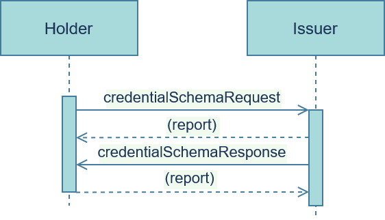

# credential-schema
Querying an agent for the schema of a specific VC that the agent can issue.

The Verifiable Credential (VC) issuance flow consists of a three step interaction process between two parties, the <u>issuer</u> and the <u>holder</u>. This is the second interaction in this process. In this interaction, the <u>holder</u> queries the <u>issuer</u> for the precise schema of one of the VCs that the <u>issuer</u> offers to issue, with it's own list of requirements which must be satisfied by the <u>holder</u> in order to qualify for the credential.

### Roles
- **Issuer**: Agent who offers and issues one or more Verifiable Credentials
- **Holder**: Agent who selects and receives one or more Verifiable Credentials

### Flow



### Messages

#### credentialSchemaRequest
The <u>holder</u> queries the <u>issuer</u> for the schema of a specific VC that the <u>issuer</u> offers.

###### Layout

```JSON
credentialSchemaRequest: {
    "context", // REQUIRED!
    "thread", // REQUIRED!
    "callbackURL", // REQUIRED!
    "credentialTypes", // REQUIRED!
    "responseRequested", //OPTIONAL!
    "id", // OPTIONAL!
    "timing" // OPTIONAL!
}
```

###### Example(s)

```JSON
{
    "context": "credential-options/1.0/credentialSchemaRequest",
    "thread": "936DA01F9ABD4d9d80C702AF85C822A8",
    "callbackURL": "https://www.bobsworld.com/",
    "credentialTypes": [
        "YouHaveNiceHairCredential",
        "YourLasagnaIsDeliciousCredential"
    ]
}
```

#### credentialSchemaResponse
The <u>issuer</u> responds with the schemata of the requested `credentialTypes`.

###### Layout

```JSON
credentialSchemaResponse: {
    "context", // REQUIRED!
    "thread", // REQUIRED!
    "schemata", // REQUIRED!
    "callbackURL", // OPTIONAL!
    "responseRequested", //OPTIONAL!
    "id", // OPTIONAL!
    "timing" // OPTIONAL!
}
```

###### Example(s)

```JSON
{
    "context": "credential-options/1.0/credentialSchemaResponse",
    "thread": "936DA01F9ABD4d9d80C702AF85C822A8",
    "schemata": [
        "YouHaveNiceHairCredential": {
            "type": "YouHaveNiceHairCredential",
            ...
        },
        "YourLasagnaIsDeliciousCredential": {
            "type": "YourLasagnaIsDeliciousCredential",
            ...
        },
    ]
}
```

[Source 1: Jolocom VC Issuance](https://jolocom.github.io/jolocom-sdk/1.0.0/guides/interaction_flows/#verifiable-credential-issuance); [Source 2: Aries Issue Credential Protocol](https://github.com/hyperledger/aries-rfcs/tree/master/features/0453-issue-credential-v2);
