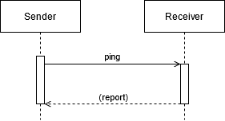

# trust-ping

Testing a pairwise channel.

### Roles
- <u>**Sender**</u>: Agent who initiates the trust ping
- <u>**Receiver**</u>: Agent who responds to the <u>senders</u> trust ping

### Flow



### Messages

#### ping
The <u>sender</u> sends the `ping` to the <u>receiver</u>. The `responseRequested` field counts as `false` if omitted. If and only if the `responseRequested` field is true should the <u>receiver</u> respond to the ping with a `report` message, posted to the `callbackURL`. If it is `true`, a `thread` should be passed as well to reference the `ping`. The `callbackURL` is OPTIONAL here because the <u>sender</u> could, for example, just include the `id` field and timing information to let the <u>receiver</u> know of transport delays.

###### Layout

```JSON
ping: {
    "context", // REQUIRED!
    "callbackURL", // OPTIONAL!
    "thread", // OPTIONAL!
    "responseRequested", //OPTIONAL!
    "id", // OPTIONAL!
    "timing" // OPTIONAL! All subfields OPTIONAL!
}
```

###### Example(s)

```JSON
{
    "context": "trust-ping/1.0/ping",
    "callbackURL": "https://www.bobsworld.com/",
    "thread": "936DA01F9ABD4d9d80C702AF85C822A8",
    "responseRequested": true,
    "id": "did:iota:57edacef81828010b314b96c0915780f206341e0ce8892a1b56678c174eef2e8",
    "timing": {
        "delay_milli": 1337
    }
}
```

[Source 1: DIF Trust Ping](https://identity.foundation/didcomm-messaging/spec/#trust-ping-protocol-10); [Source 2: Aries Trust Ping](https://github.com/hyperledger/aries-rfcs/tree/master/features/0048-trust-ping);