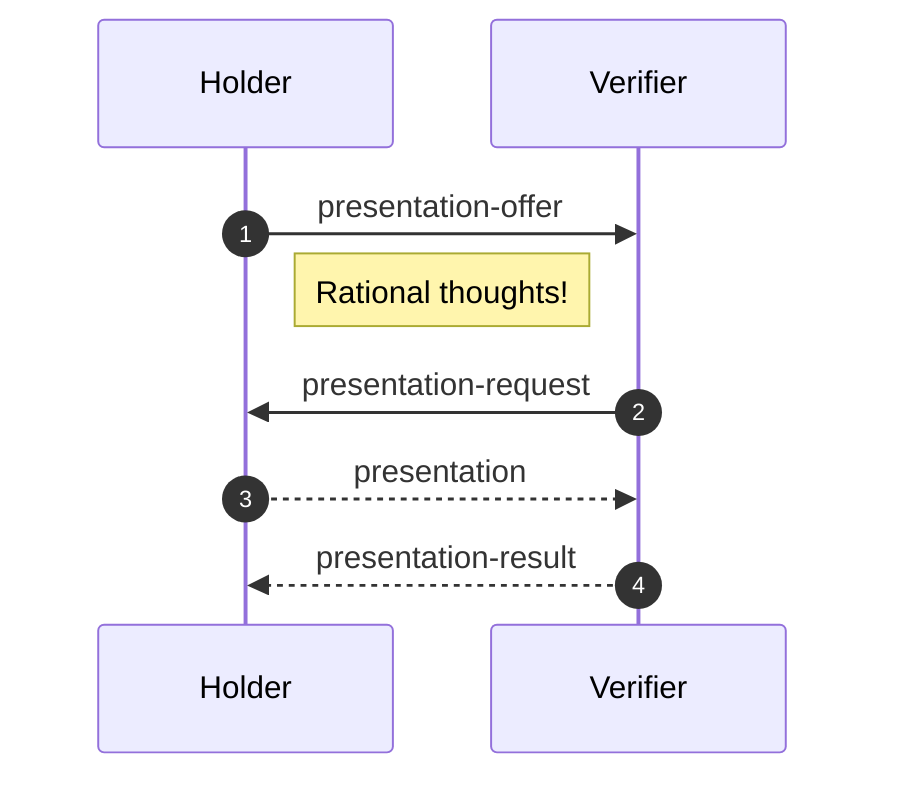
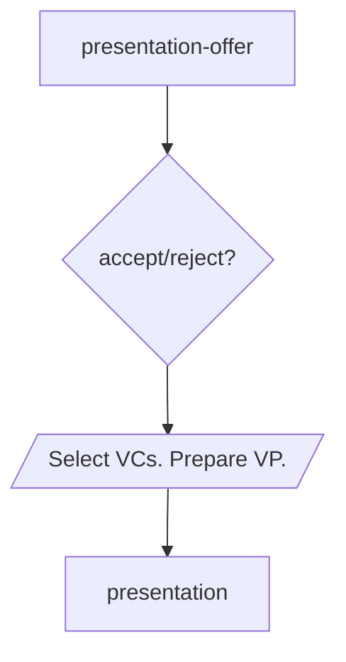
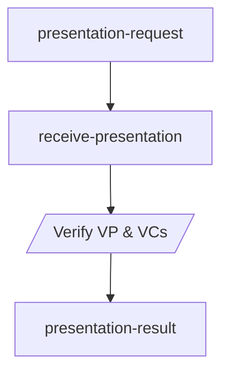
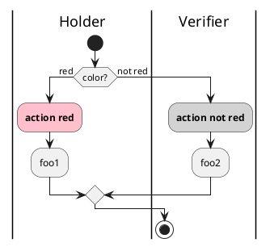
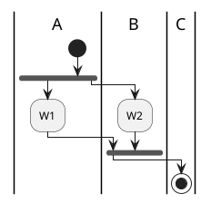

# Presentation

- Status: IN-PROGRESS
- Start Date: 2021-09-02
- Last Updated: 2021-09-02

## Summary/Goals

Allows verification of unrevoked credentials that are undeniable issued for the holder and uniquely presented to the verifier.

## Example Use-Cases

## Specification






    
    presentation-result --> end;
    




<iframe frameBorder="0" style={{width:'100%',height:'393px',}} src="https://viewer.diagrams.net/?highlight=0000ff&edit=_blank&layers=1&nav=1&title=Untitled%20Diagram.drawio#R7Vhbl9IwEP41HJ%2F09IIFHi277Kq4Z5XVPT6GNrSRtFPTlIu%2F3glNaUuRi8peOMsDJzMdJsl831xoy%2B5HiytBkvAT%2BJS3LMNftOyLlmX1rC5%2BK8UyVzjtdq4IBPNzlVkqRuwX1UpDazPm07RmKAG4ZEld6UEcU0%2FWdEQImNfNJsDruyYkoA3FyCO8qb1nvgxzbdfqlPpryoKw2Nl0evmTiBTG%2BiZpSHyYV1T2ZcvuCwCZr6JFn3IVuyIu9%2B%2BX93w4da4%2BfE5%2Fkq%2Fux7ubb69zZ4NjfrK%2BgqCx%2FL%2Burdz1jPBMx0vfVS6LAArIYp8qJ0bLdkMZcVyauPxBpVxqwEkmAVUgZAgBxIQPARJtN4FYajNTyTT23ylgUR5z8Ka5asA413ugpO27KKVSwHSNnXKwBkIZczKm3CXeNFgdtA8cBD6KIabKlY9k0HcpD3dZat0DY6sxSCETHt1hZ2uKExHQXf6c3E6dr8JTjdwVhYhKsUQDQTmRbFYnM9E5EaztStxxoaE%2FggZ2gwZDEiUq64Gm8SuJqzmI6Q5uKFzmIZN0lJBVgOZYTep8qfIAr%2BoGnKSpRnEPyMeBNKNC0sXOsBZPHZ3burh1tTgvK4VZpH9YqRJt40RAtBtAfMfi%2BZKS%2F5KSzoEpWXSsvTmpyVIQ4%2BAU1Z5ugcWyYgKTSYoH26TOesO%2FZ9PbBptuoEGm%2FXg8a7o9Epk6x3HJfPJccv7QIhyOYXDHAleBWiU8CwIkC7qLW%2FagWbtCiMZZur9d1DBWDBqQiHEVr2vKZ1Qyj2xpKoSzAPe98BBuKraTB7dkcYCSU0p3K7Ji%2FT1hs%2BnUm81arnYbY0u36Z6q23QamN4iejl0lsFX%2BJ5Zx7etDRB6j93yu4cU6Wddgh%2B84xfVdH%2FLNw8s05o9xhsbPzUCPf0poHfQTPkyBpyGYda5DQLFCSt8cjM%2Bbk4C40zEq0EAMvkyCeyaBKxtTehBJ4GiEFZA%2FUITwhBMY3iOc8DmP%2F%2B2%2FdhzQFEp6hBwFVPLyDPszDDYnMVs83QYoFi%2Bqc1LYfm62778DQ%3D%3D"></iframe>

### Messages

#### 1. presentation-offer

```typescript
PresentationOffer: {
  offers: [credentialOffer]; // REQUIRED
  requireSignature: bool; // OPTIONAL - indicates whether the request will be rejected automatically if not signed by the requester?
};
```

```js
credentialOffer = {
  context: [string], // optional
  types: [string], // required
  issuer: string, // optional
}

```
TODO: ZKP / selective disclosure fields?
#### 2. presentation-request

#### 3. presentation

#### 4. presentation-result

## Concerns?

- Non-repudiation - credentials cannot be spoofed, guaranteed to be current and valid from issuer.
- Ease of use - easy for holder to present (and retry)?

## Non-goals?

- Security: implementors should ensure the presentation is transmitted over an encrypted channel etc.
- Identification:
- Authorisation:

## Unresolved Questions/Concerns?

## Related Work

- Aries Hyperledger: https://github.com/hyperledger/aries-rfcs/tree/main/features/0454-present-proof-v2
- Jolocom: https://jolocom.github.io/jolocom-sdk/1.0.0/guides/interaction_flows/#credential-verification

## References

- https://w3c.github.io/vc-imp-guide/#presentations
- https://www.w3.org/TR/vc-data-model/#presentations
