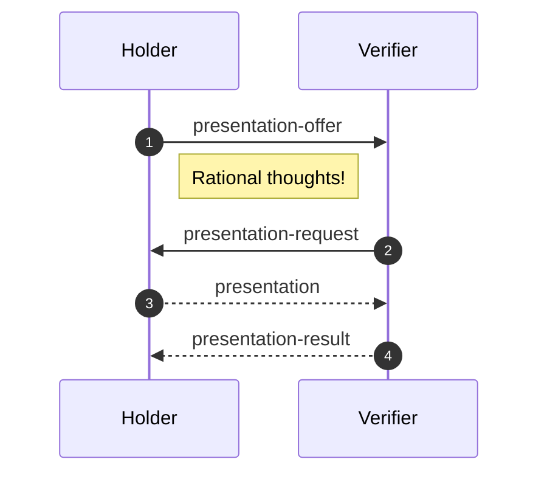
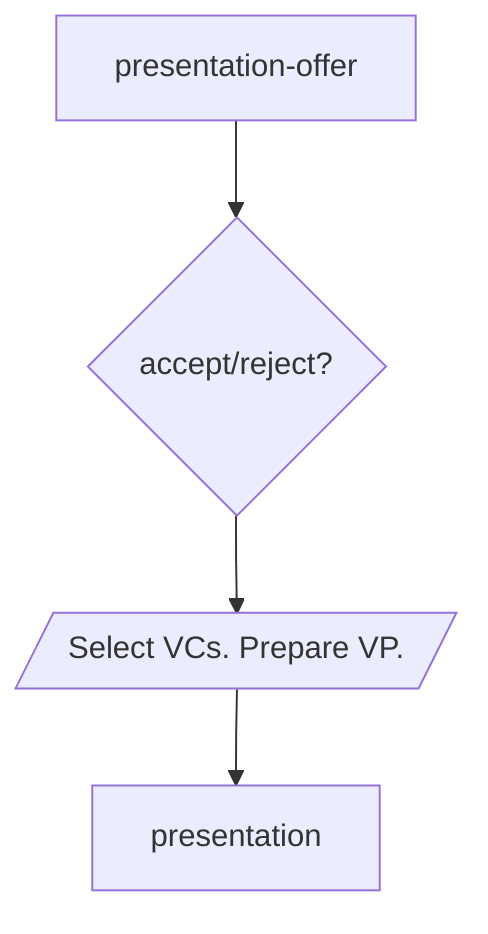
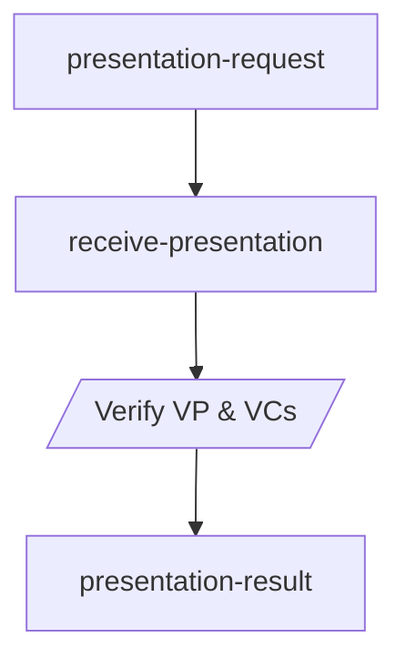
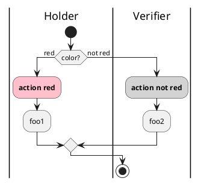
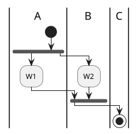

# Presentation

- Status: IN-PROGRESS
- Start Date: 2021-09-02
- Last Updated: 2021-09-06

## Summary/Goals

Allows presentation of verifiable credentials that are issued to a holder and uniquely presented to a third-party verifier.

## Example Use-Cases

## Specification

### Roles: 
- [Holder](https://www.w3.org/TR/vc-data-model/#dfn-holders): possesses one or more credentials that are combined in a verifiable presentation to show proof of ownership to the verifier.
- [Verifier](https://www.w3.org/TR/vc-data-model/#dfn-verifier): receives and validates the credentials presented by the holder.







    
    presentation-result --> end;
    




<iframe frameBorder="0" style={{width:'100%',height:'393px',}} src="https://viewer.diagrams.net/?highlight=0000ff&edit=_blank&layers=1&nav=1&title=Untitled%20Diagram.drawio#R7Vhbl9IwEP41HJ%2F09IIFHi277Kq4Z5XVPT6GNrSRtFPTlIu%2F3glNaUuRi8peOMsDJzMdJsl831xoy%2B5HiytBkvAT%2BJS3LMNftOyLlmX1rC5%2BK8UyVzjtdq4IBPNzlVkqRuwX1UpDazPm07RmKAG4ZEld6UEcU0%2FWdEQImNfNJsDruyYkoA3FyCO8qb1nvgxzbdfqlPpryoKw2Nl0evmTiBTG%2BiZpSHyYV1T2ZcvuCwCZr6JFn3IVuyIu9%2B%2BX93w4da4%2BfE5%2Fkq%2Fux7ubb69zZ4NjfrK%2BgqCx%2FL%2Burdz1jPBMx0vfVS6LAArIYp8qJ0bLdkMZcVyauPxBpVxqwEkmAVUgZAgBxIQPARJtN4FYajNTyTT23ylgUR5z8Ka5asA413ugpO27KKVSwHSNnXKwBkIZczKm3CXeNFgdtA8cBD6KIabKlY9k0HcpD3dZat0DY6sxSCETHt1hZ2uKExHQXf6c3E6dr8JTjdwVhYhKsUQDQTmRbFYnM9E5EaztStxxoaE%2FggZ2gwZDEiUq64Gm8SuJqzmI6Q5uKFzmIZN0lJBVgOZYTep8qfIAr%2BoGnKSpRnEPyMeBNKNC0sXOsBZPHZ3burh1tTgvK4VZpH9YqRJt40RAtBtAfMfi%2BZKS%2F5KSzoEpWXSsvTmpyVIQ4%2BAU1Z5ugcWyYgKTSYoH26TOesO%2FZ9PbBptuoEGm%2FXg8a7o9Epk6x3HJfPJccv7QIhyOYXDHAleBWiU8CwIkC7qLW%2FagWbtCiMZZur9d1DBWDBqQiHEVr2vKZ1Qyj2xpKoSzAPe98BBuKraTB7dkcYCSU0p3K7Ji%2FT1hs%2BnUm81arnYbY0u36Z6q23QamN4iejl0lsFX%2BJ5Zx7etDRB6j93yu4cU6Wddgh%2B84xfVdH%2FLNw8s05o9xhsbPzUCPf0poHfQTPkyBpyGYda5DQLFCSt8cjM%2Bbk4C40zEq0EAMvkyCeyaBKxtTehBJ4GiEFZA%2FUITwhBMY3iOc8DmP%2F%2B2%2FdhzQFEp6hBwFVPLyDPszDDYnMVs83QYoFi%2Bqc1LYfm62778DQ%3D%3D"></iframe>

## Messages

### 1. `presentation-offer` {#presentation-offer}

- Type: `didcomm:iota/presentation/0.1/presentation-offer`
- Role: [holder](#roles)

This message is sent by the holder to offer one or more credentials for a verifier to view. 
The context and types are included to allow the verifier to choose whether they are interested in the offer, negotiate the type of credentials they want or accept and by which issuers they trust.

The issuer is optional when the holder may not want to reveal too much information up-front on the exact credentials they possess, they may want a non-repudiable signed request from the verifier first? 
```json
didcomm:iota/presentation/0.1/presentation-offer
spec:iota-didcomm/presentation/0.1/presentation-offer
{
  "offers": [{
    "@context": [string],   // OPTIONAL
    "type": [string],       // REQUIRED
    "issuer": string,       // OPTIONAL
  }], // REQUIRED
  "requireSignature": bool, // OPTIONAL
}
```

| Field | Description | Required |
| :--- | :--- | :--- |
| `offers` | Array of one or more offers, each specifying a single credential possessed by the holder. | REQUIRED |
| [`@context`](https://www.w3.org/TR/vc-data-model/#contexts) | Array of JSON-LD contexts referenced in the credential. | OPTIONAL |
| [`type`](https://www.w3.org/TR/vc-data-model/#types) | Array of credential types specifying . | REQUIRED | 
| [`issuer`](https://www.w3.org/TR/vc-data-model/#issuer) | The ID or URI of the credential issuer. | OPTIONAL |
| `requireSignature` | Request that the verifier sign its [`presentation-request`](#presentation-request) with a proof. It is RECOMMENDED that the holder issues a `problem-report` if the verifier does not sign the message when this is true. | OPTIONAL |

TODO: how do we elaborate on design decision? E.g. issuer is optional because one may not want to reveal too much information up-front (privacy)

TODO: selective disclosure / ZKP fields?

#### Examples

1. Offering a single verifiable credential:

```json
{
  "offers": [{
    "type": ["VerifiableCredential", "UniversityDegreeCredential"],
    "issuer": "did:example:76e12ec712ebc6f1c221ebfeb1f"
  }]
}
```

2. Offering two verifiable credentials with different issuers:

```json
{
  "offers": [{
    "type": ["VerifiableCredential", "UniversityDegreeCredential"],
    "issuer": "did:example:76e12ec712ebc6f1c221ebfeb1f"
  }, 
  {
    "type": ["VerifiableCredential", "UniversityDegreeCredential"],
    "issuer": "https://example.edu/issuers/565049"
  }]
}
```

### 2. `presentation-request` {#presentation-request}

- Type: `didcomm:iota/presentation/0.1/presentation-request`
- Role: [verifier](#roles)

This message is sent by the verifier to request one or more verifiable credentials from a holder. 
The context and types are included, as well as trusted issuers, to allow the holder to determine if he posseses relevant credentials. This message allows a non-repudiable proof, that the verfifier requested data. 

```json
{
  "requests": [{
    "@context": [string],       // OPTIONAL
    "type": [string],           // REQUIRED
    "trustedIssuers": [string], // OPTIONAL
    "optional": bool            // OPTIONAL
  }], // REQUIRED
  "challenge": string,          // REQUIRED
  "proof": Proof                // OPTIONAL
}
```

| Field | Description | Required |
| :--- | :--- | :--- |
| `requests` | Array of one or more requests, each specifying a single credential possessed by the holder. | REQUIRED |
| [`@context`](https://www.w3.org/TR/vc-data-model/#contexts) | Array of JSON-LD contexts referenced in a credential. | OPTIONAL |
| [`type`](https://www.w3.org/TR/vc-data-model/#types) | Array of credential types; a presented credential SHOULD match all types specified. | REQUIRED | 
| [`trustedIssuers`](https://www.w3.org/TR/vc-data-model/#issuer) | Array of credential issuer IDs or URIs that the verifier would accept. | OPTIONAL |
| `optional` | Whether this credential is required (`false`) or optional (`true`) to present by the holder. A holder should send a problem report if unable to satisfy a non-optional credential request. Default: `false`. | OPTIONAL |
| [`challenge`](https://w3c-ccg.github.io/ld-proofs/#dfn-challenge) | A random string unique per [`presentation-request`](#presentation-request) by a verifier to help mitigate replay attacks. | REQUIRED |
| [`proof`](https://w3c-ccg.github.io/ld-proofs/) | Signature of the verifier; RECOMMENDED to include if preceded by a [`presentation-offer`](#presentation-offer) with `requireSignature = true`. | OPTIONAL |

Verifiers are RECOMMENDED to include a proof whenever possible to avoid rejections from holders that enforce non-repudiation. Holders could use this to prove that a verifier is non-compliant with laws or regulations, e.g. over-requesting information protected by [GDPR](https://gdpr-info.eu/). Holders may still choose to accept unsigned [`presentation-requests`](#presentation-request) on a case-by-case basis, even if `requireSignature` was `true` in their [`presentation-offer`](#presentation-offer), as some verifiers may be unable to perform cryptographic signing operations.

Note that the `proof` is not required for authentication of the verifier in general; it is RECOMMENDED to use [Sender Authenticated Encryption](https://identity.foundation/didcomm-messaging/spec/#sender-authenticated-encryption) for authentication of parties in a DID-Comm thread.

#### Examples

1. TBD

```json
{
  "challenge": string,          // REQUIRED
}
```

2. TBD

```json
{

}
```

### 3. `presentation` {#presentation}

- Type: `didcomm:iota/presentation/0.1/presentation`
- Role: [holder](#roles)

TBD

```json
{
  "vp": string          // REQUIRED
}
```

| Field | Description | Required |
| :--- | :--- | :--- |
| [`vp`](https://www.w3.org/TR/vc-data-model/#presentations-0) | TBD | REQUIRED |

#### Examples

1. TBD

```json
{
  
}
```

2. TBD

```json
{

}
```

### 4. `presentation-result` {#presentation-result}

- Type: `didcomm:iota/presentation/0.1/presentation-result`
- Role: [verifier](#roles)

TBD

```json
{
  "accepted": bool,                   // REQUIRED
  "problems": [{
    "problemReport": ProblemReport,   // REQUIRED
    "dispute": Dispute,               // OPTIONAL
  }], // OPTIONAL
  "allowRetry": bool,                 // OPTIONAL
  "proof": Proof                      // OPTIONAL - recommended since some parties may be unable to sign requests but holder implementations should reject unsigned requests by default
}
```

| Field | Description | Required |
| :--- | :--- | :--- |
| `accepted` | TBD | REQUIRED |
| `problems` | TBD | OPTIONAL |
| `problemReport` | TBD | REQUIRED | 
| `allowRetry` | TBD | OPTIONAL |
| [`proof`](https://w3c-ccg.github.io/ld-proofs/) | TBD  | OPTIONAL |

#### Examples

1. TBD

```json
{

}
```

2. TBD

```json
{

}
```

## Concerns?

- Non-repudiation - credentials cannot be spoofed, guaranteed to be current and valid from issuer.
- Ease of use - easy for holder to present (and retry)?

## Non-goals?

- Security: implementors should ensure the presentation is transmitted over an encrypted channel etc.
- Identification:
- Authorisation:

## Problem Reports

TODO

Custom error messages for problem-reports that are expected in the course of this protocol. Non-exhaustive, just a normative list of errors that are expected to be thrown.
- prot.iota.presentation.reject-request
- prot.issuance.reject-vc
- prot.signing.reject-request
- prot.revocation.reject-request
- prot.feature-discovery.reject-request

## Unresolved Questions

- Is a `schema` field needed for the `presentation-offer` and `presentation-request` to identify the types of verifiable credentials and allow forward compatibility for different fields in the message? The E.g. a `SelectiveDisclosure` message may only offer or request certain fields in the credential.  

## Related Work

- Aries Hyperledger: https://github.com/hyperledger/aries-rfcs/tree/main/features/0454-present-proof-v2
- Jolocom: https://jolocom.github.io/jolocom-sdk/1.0.0/guides/interaction_flows/#credential-verification

## References

- https://w3c.github.io/vc-imp-guide/#presentations
- https://www.w3.org/TR/vc-data-model/#presentations
