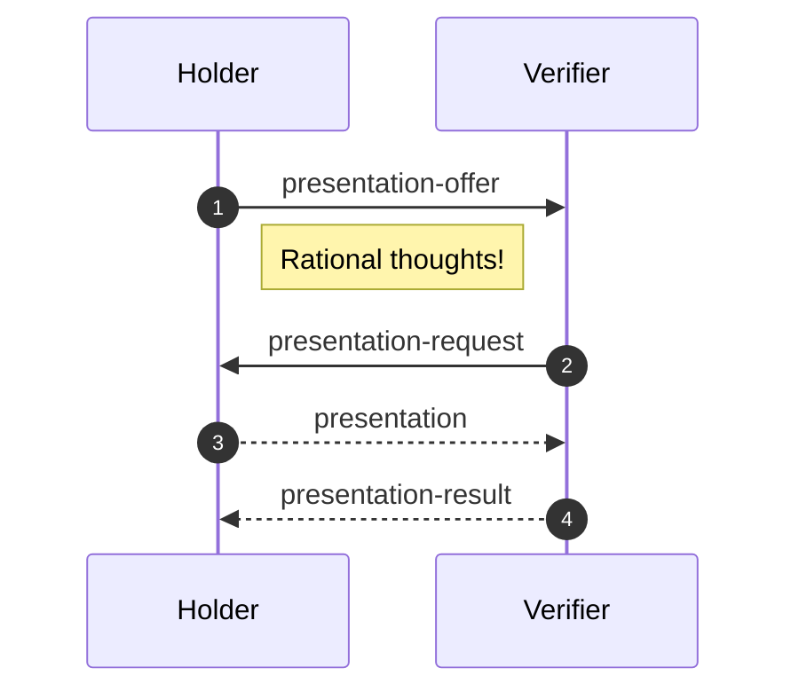
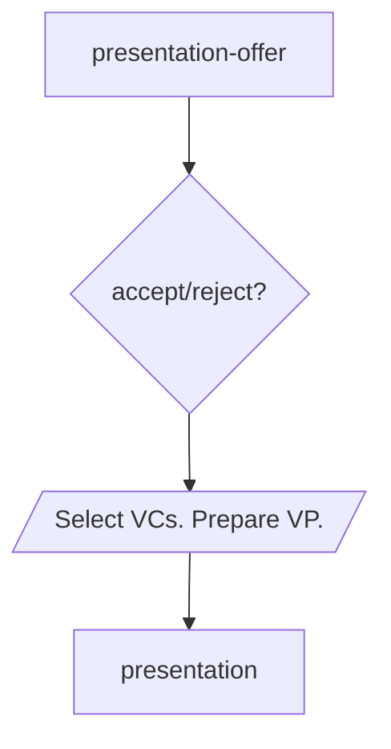
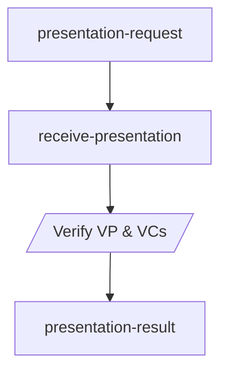
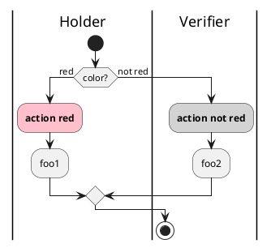
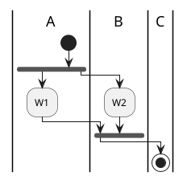

# Presentation

- Status: `IN-PROGRESS`
- Start Date: 2021-09-02
- Last Updated: 2021-09-07

## Summary/Goals

Allows presentation of verifiable credentials that are issued to a holder and uniquely presented to a third-party verifier.

## Example Use-Cases

## Specification

### Roles: 
- [Holder](https://www.w3.org/TR/vc-data-model/#dfn-holders): possesses one or more credentials that are combined in a verifiable presentation to show proof of ownership to the verifier.
- [Verifier](https://www.w3.org/TR/vc-data-model/#dfn-verifier): receives and validates the credentials presented by the holder.







    
    presentation-result --> end;
    




<iframe frameBorder="0" style={{width:'100%',height:'393px',}} src="https://viewer.diagrams.net/?highlight=0000ff&edit=_blank&layers=1&nav=1&title=Untitled%20Diagram.drawio#R7Vhbl9IwEP41HJ%2F09IIFHi277Kq4Z5XVPT6GNrSRtFPTlIu%2F3glNaUuRi8peOMsDJzMdJsl831xoy%2B5HiytBkvAT%2BJS3LMNftOyLlmX1rC5%2BK8UyVzjtdq4IBPNzlVkqRuwX1UpDazPm07RmKAG4ZEld6UEcU0%2FWdEQImNfNJsDruyYkoA3FyCO8qb1nvgxzbdfqlPpryoKw2Nl0evmTiBTG%2BiZpSHyYV1T2ZcvuCwCZr6JFn3IVuyIu9%2B%2BX93w4da4%2BfE5%2Fkq%2Fux7ubb69zZ4NjfrK%2BgqCx%2FL%2Burdz1jPBMx0vfVS6LAArIYp8qJ0bLdkMZcVyauPxBpVxqwEkmAVUgZAgBxIQPARJtN4FYajNTyTT23ylgUR5z8Ka5asA413ugpO27KKVSwHSNnXKwBkIZczKm3CXeNFgdtA8cBD6KIabKlY9k0HcpD3dZat0DY6sxSCETHt1hZ2uKExHQXf6c3E6dr8JTjdwVhYhKsUQDQTmRbFYnM9E5EaztStxxoaE%2FggZ2gwZDEiUq64Gm8SuJqzmI6Q5uKFzmIZN0lJBVgOZYTep8qfIAr%2BoGnKSpRnEPyMeBNKNC0sXOsBZPHZ3burh1tTgvK4VZpH9YqRJt40RAtBtAfMfi%2BZKS%2F5KSzoEpWXSsvTmpyVIQ4%2BAU1Z5ugcWyYgKTSYoH26TOesO%2FZ9PbBptuoEGm%2FXg8a7o9Epk6x3HJfPJccv7QIhyOYXDHAleBWiU8CwIkC7qLW%2FagWbtCiMZZur9d1DBWDBqQiHEVr2vKZ1Qyj2xpKoSzAPe98BBuKraTB7dkcYCSU0p3K7Ji%2FT1hs%2BnUm81arnYbY0u36Z6q23QamN4iejl0lsFX%2BJ5Zx7etDRB6j93yu4cU6Wddgh%2B84xfVdH%2FLNw8s05o9xhsbPzUCPf0poHfQTPkyBpyGYda5DQLFCSt8cjM%2Bbk4C40zEq0EAMvkyCeyaBKxtTehBJ4GiEFZA%2FUITwhBMY3iOc8DmP%2F%2B2%2FdhzQFEp6hBwFVPLyDPszDDYnMVs83QYoFi%2Bqc1LYfm62778DQ%3D%3D"></iframe>

## Messages

### 1. `presentation-offer` {#presentation-offer}

- Type: `didcomm:iota/presentation/0.1/presentation-offer`
- Role: [holder](#roles)

Sent by the holder to offer one or more credentials for a verifier to view. 
The context and types are included to allow the verifier to choose whether they are interested in the offer, negotiate the type of credentials they want or accept and by which issuers they trust.

The issuer is optional when the holder may not want to reveal too much information up-front on the exact credentials they possess, they may want a non-repudiable signed request from the verifier first? 
```json
{
  "offers": [{
    "@context": [string],   // OPTIONAL
    "type": [string],       // REQUIRED
    "issuer": string,       // OPTIONAL
  }], // REQUIRED
  "requireSignature": bool, // OPTIONAL
}
```

| Field | Description | Required |
| :--- | :--- | :--- |
| `offers` | Array of one or more offers, each specifying a single credential possessed by the holder. | REQUIRED |
| [`@context`](https://www.w3.org/TR/vc-data-model/#contexts) | Array of JSON-LD contexts referenced in the credential. | OPTIONAL |
| [`type`](https://www.w3.org/TR/vc-data-model/#types) | Array of credential types specifying . | REQUIRED | 
| [`issuer`](https://www.w3.org/TR/vc-data-model/#issuer) | The ID or URI of the credential issuer. | OPTIONAL |
| `requireSignature` | Request that the verifier sign its [`presentation-request`](#presentation-request) with a proof. It is RECOMMENDED that the holder issues a `problem-report` if the verifier does not sign the message when this is true. | OPTIONAL |

TODO: how do we elaborate on design decision? E.g. issuer is optional because one may not want to reveal too much information up-front (privacy)

TODO: selective disclosure / ZKP fields?

#### Examples

1. Offer a single verifiable credential:

```json
{
  "offers": [{
    "type": ["VerifiableCredential", "UniversityDegreeCredential"],
    "issuer": "did:example:76e12ec712ebc6f1c221ebfeb1f"
  }]
}
```

2. Offer two verifiable credentials with different issuers:

```json
{
  "offers": [{
    "type": ["VerifiableCredential", "UniversityDegreeCredential"],
    "issuer": "did:example:76e12ec712ebc6f1c221ebfeb1f"
  }, 
  {
    "type": ["VerifiableCredential", "UniversityDegreeCredential"],
    "issuer": "https://example.edu/issuers/565049"
  }]
}
```

### 2. `presentation-request` {#presentation-request}

- Type: `didcomm:iota/presentation/0.1/presentation-request`
- Role: [verifier](#roles)

Sent by the verifier to request one or more verifiable credentials from a holder. 
The context and types are included, as well as trusted issuers, to allow the holder to determine if he posseses relevant credentials. This message allows a non-repudiable proof, that the verfifier requested data. 

```json
{
  "requests": [{
    "@context": [string],       // OPTIONAL
    "type": [string],           // REQUIRED
    "trustedIssuer": [string],  // OPTIONAL
    "optional": bool            // OPTIONAL
  }], // REQUIRED
  "challenge": string,          // REQUIRED
  "proof": Proof                // OPTIONAL
}
```

| Field | Description | Required |
| :--- | :--- | :--- |
| `requests` | Array of one or more requests, each specifying a single credential possessed by the holder. | REQUIRED |
| [`@context`](https://www.w3.org/TR/vc-data-model/#contexts) | Array of JSON-LD contexts referenced in a credential. | OPTIONAL |
| [`type`](https://www.w3.org/TR/vc-data-model/#types) | Array of credential types; a presented credential SHOULD match all types specified. | REQUIRED | 
| [`trustedIssuer`](https://www.w3.org/TR/vc-data-model/#issuer) | Array of credential issuer IDs or URIs that the verifier would accept. | OPTIONAL |
| `optional` | Whether this credential is required (`false`) or optional (`true`) to present by the holder. A holder should send a problem report if unable to satisfy a non-optional credential request. Default: `false`. | OPTIONAL |
| [`challenge`](https://w3c-ccg.github.io/ld-proofs/#dfn-challenge) | A random string unique per [`presentation-request`](#presentation-request) by a verifier to help mitigate replay attacks. | REQUIRED |
| [`proof`](https://w3c-ccg.github.io/ld-proofs/) | Signature of the verifier; RECOMMENDED to include if preceded by a [`presentation-offer`](#presentation-offer) with `requireSignature = true`. | OPTIONAL |

Verifiers are RECOMMENDED to include a proof whenever possible to avoid rejections from holders that enforce non-repudiation. Holders could use this to prove that a verifier is non-compliant with laws or regulations, e.g. over-requesting information protected by [GDPR](https://gdpr-info.eu/). Holders may still choose to accept unsigned [`presentation-requests`](#presentation-request) on a case-by-case basis, even if `requireSignature` was `true` in their [`presentation-offer`](#presentation-offer), as some verifiers may be unable to perform cryptographic signing operations. If the `proof` is invalid, the receiving holder MUST send a `problem-report`.

Note that the `proof` is not required for authentication of the verifier in general; it is RECOMMENDED to use [Sender Authenticated Encryption](https://identity.foundation/didcomm-messaging/spec/#sender-authenticated-encryption) for authentication of parties in a DID-Comm thread.

#### Examples

1. Request a single credential matching both specified types.

```json
{
  "requests": [{
    "type": ["VerifiableCredential", "UniversityDegreeCredential"]
  }],
  "challenge": "06da6f1c-26b0-4976-915d-670b8f407f2d"
}
```

2. Signed request of a required credential from a particular trusted issuer and an optional credential. 

```json
{
  "requests": [{
    "type": ["VerifiableCredential", "UniversityDegreeCredential"],
    "trustedIssuer": ["did:example:76e12ec712ebc6f1c221ebfeb1f"]
  }, {
    "type": ["VerifiableCredential", "DriversLicence"],
    "optional": true
  }], 
  "challenge": "06da6f1c-26b0-4976-915d-670b8f407f2d",
  "proof": { ... }
}
```

3. Request a single credential signed by one of several trusted issuers.

```json
{
  "requests": [{
    "type": ["VerifiableCredential", "UniversityDegreeCredential"],
    "trustedIssuer": ["did:example:76e12ec712ebc6f1c221ebfeb1f", "did:example:f1befbe122c1f6cbe217ce21e67", "did:example:c6ef1fe11eb22cb711e6e227fbc"],
    "optional": false
  }], 
  "challenge": "06da6f1c-26b0-4976-915d-670b8f407f2d",
}
```

### 3. `presentation` {#presentation}

- Type: `didcomm:iota/presentation/0.1/presentation`
- Role: [holder](#roles)

Sent by the holder to present a [verifiable presentation](https://www.w3.org/TR/vc-data-model/#presentations-0) of one or more [verifiable credentials](https://www.w3.org/TR/vc-data-model/#credentials) for a [verifier](#roles) to review.

```json
{
  "vp": VP // REQUIRED
}
```

| Field | Description | Required |
| :--- | :--- | :--- |
| [`vp`](https://www.w3.org/TR/vc-data-model/#presentations-0) | Signed [verifiable presentation](https://www.w3.org/TR/vc-data-model/#presentations-0) containing one or more [verifiable credentials](https://www.w3.org/TR/vc-data-model/#credentials) matching the [presentation-request](#presentation-request) | REQUIRED |

The [presentation `proof`](https://www.w3.org/TR/vc-data-model/#proofs-signatures) section in `vp` MUST include the `challenge` sent by the verifier in the preceding [`presentation-request`](#presentation-request). The included credentials SHOULD match all `type` fields and one or more `trustedIssuer` if included in the [`presentation-request`](#presentation-request). Revoked, disputed, or otherwise invalid presentations or credentials MUST result in a rejected [`presentation-result`](#presentation-result) sent back to the holder, NOT a separate [`problem-report`].

#### Examples

1. Presentation of a verifiable presentation credential.

```json
{
  "vp": {
    "@context": [
      "https://www.w3.org/2018/credentials/v1",
      "https://www.w3.org/2018/credentials/examples/v1"
    ],
    "type": "VerifiablePresentation",
    "verifiableCredential": [{
      "@context": [
        "https://www.w3.org/2018/credentials/v1",
        "https://www.w3.org/2018/credentials/examples/v1"
      ],
      "id": "6c1a1477-e452-4da7-b2db-65ad0b369d1a",
      "type": ["VerifiableCredential", "UniversityDegreeCredential"],
      "issuer": "did:example:76e12ec712ebc6f1c221ebfeb1f",
      "issuanceDate": "2021-05-03T19:73:24Z",
      "credentialSubject": {
        "id": "did:example:ebfeb1f712ebc6f1c276e12ec21",
        "degree": {
          "type": "BachelorDegree",
          "name": "Bachelor of Science and Arts"
        }
      },
      "proof": { ... }
    }],
    "proof": {
      "challenge": "06da6f1c-26b0-4976-915d-670b8f407f2d",
      ...
    }
  }
}
```

### 4. `presentation-result` {#presentation-result}

- Type: `didcomm:iota/presentation/0.1/presentation-result`
- Role: [verifier](#roles)

Sent by the verifier to communicate the result of the presentation. It allows the verifier raise problems and disputes encountered in the verification and to specify if the holder may retry a presentation. The message may be signed for non-repudiation.  

```json
{
  "accepted": bool,                   // REQUIRED
  "disputes": [{
    "id": string,                     // OPTIONAL
    "dispute": Dispute,               // REQUIRED
  }], // OPTIONAL
  "problems": [{
    "id": string,                     // OPTIONAL
    "problemReport": ProblemReport,   // REQUIRED
  }], // OPTIONAL
  "allowRetry": bool,                 // OPTIONAL
  "proof": Proof                      // OPTIONAL
}
```

| Field | Description | Required |
| :--- | :--- | :--- |
| `accepted` | Indicates if the verifer accepted the [`presentation`](#presentation) and credentials. | REQUIRED |
| `disputes` | Array of disputes | OPTIONAL |
| [`id`](https://www.w3.org/TR/vc-data-model/#identifiers) | Identifier of the credential for which there is a problem or dispute. A holder may omit credential identifiers for privacy reasons. | OPTIONAL |
| [`dispute`](https://www.w3.org/TR/vc-data-model/#disputes) | A [dispute](https://www.w3.org/TR/vc-data-model/#disputes) by the verifier of one or more claims in a presented credential. | REQUIRED |
| `problems` | Array of problem-reports | OPTIONAL |
| `problemReport` | A [`problem-report`](https://identity.foundation/didcomm-messaging/spec/#problem-reports) indicating something wrong with the credential, e.g. signature validation failed or the credential is expired. | REQUIRED | 
| `allowRetry` | Indicates if the holder may retry the [`presentation`](#presentation) with different credentials. Default: `false` | OPTIONAL |
| [`proof`](https://w3c-ccg.github.io/ld-proofs/) | Signature of the verifier; RECOMMENDED to include. | OPTIONAL |

Similar to [`presentation-request`](#presentation-request), verifiers are RECOMMENDED to include a proof whenever possible for non-repudiation of receipt of the presentation. Holders may choose to blocklist verifiers that refuse to provide non-repudiable signatures.

#### Examples

1. Successful result, including a proof for non-repudiation.

```json
{
  "accepted": true,
  "proof": { ... }
}
```

2. Unsucessful result disputing a credential, allowing the holder to retry. 

```json
{
  "accepted": false,
  "disputes": [{
    "id": "http://example.com/credentials/123",
    "dispute": {
      "@context": [
        "https://www.w3.org/2018/credentials/v1",
        "https://www.w3.org/2018/credentials/examples/v1"
      ],
      "id": "http://example.com/credentials/123",
      "type": ["VerifiableCredential", "DisputeCredential"],
      "credentialSubject": {
        "id": "http://example.com/credentials/245",
        "currentStatus": "Disputed",
        "statusReason": {
          "value": "Address is out of date.",
          "lang": "en"
        },
      },
      "issuer": "did:example:76e12ec712ebc6f1c221ebfeb1f",
      "issuanceDate": "2017-12-05T14:27:42Z",
      "proof": { ... }
    }
  }],
  "allowRetry": true
}
```

3. Unsuccessful result with a `problem-report`, disallowing retries. 

```json
{
  "accepted": false,
  "problems": [{
    "id": "6c1a1477-e452-4da7-b2db-65ad0b369d1a",
    "problemReport": {
      "type": "https://didcomm.org/notify/1.0/problem-report",
      "id": "7c9de639-c51c-4d60-ab95-103fa613c805",
      "pthid": "1e513ad4-48c9-444e-9e7e-5b8b45c5e325",
      "body": {
        "code": "e.p.trust.crypto.credential-proof-invalid",
        "comment": "Signature failed validation for credential {1}.",
        "args": [
          "http://example.com/credentials/123",
        ],
      }
  }],
  "allowRetry": false
}
```

TODO: change problem-report here, or remove them from the result altogether? Example of a hacker trying to brute-force disputes with unsigned credentials, in which case the problem report (trust.crypto) should just end the flow and not return disputes.

## Concerns?

- Non-repudiation - credentials cannot be spoofed, guaranteed to be current and valid from issuer.
- Ease of use - easy for holder to present (and retry)?

## Non-goals?

- Security: implementors should ensure the presentation is transmitted over an encrypted channel etc.
- Identification:
- Authorisation:

## Problem Reports

See: https://identity.foundation/didcomm-messaging/spec/#descriptors
TODO

Custom error messages for problem-reports that are expected in the course of this protocol. Non-exhaustive, just a normative list of errors that are expected to be thrown.
- e.p.prot.iota.presentation.reject-request
- e.p.trust.crypto.prot.iota.presentation
- e.p.prot.iota.presentation.trust.crypto
- e.p.prot.iota.trust.crypto

```
{
  "type": "https://didcomm.org/notify/1.0/problem-report",
  "id": "7c9de639-c51c-4d60-ab95-103fa613c805",
  "pthid": "1e513ad4-48c9-444e-9e7e-5b8b45c5e325",
  "body": {
    "code": "e.p.xfer.cant-use-endpoint",
    "protocol": "didcomm:iota/presentation/0.1", // TODO: add custom fields?
    "comment": "Unable to use the {1} endpoint for {2}.",
    "args": [
      "https://agents.r.us/inbox",
      "did:sov:C805sNYhMrjHiqZDTUASHg"
    ],
    "escalate_to": "mailto:admin@foo.org"
  }
}
```

## Unresolved Questions

- Is a `schema` field needed for the `presentation-offer` and `presentation-request` to identify the types of verifiable credentials and allow forward compatibility for different fields in the message? The E.g. a `SelectiveDisclosure` or ZKP message may only offer or request certain fields in the credential. Does this relate to the [`credentialSchema`](https://www.w3.org/TR/vc-data-model/#data-schemas) field in credentials?
- Identifiers (`id` field) are [optional in verifiable credentials](https://www.w3.org/TR/vc-data-model/#identifiers). The spec suggests content-addressed identifiers when the `id` is not available but their particulars are unclear as there is no spec referenced. This affects the `problems` reported in the [`presentation-result`](#presentation-result).
- We should RECOMMENDED the `id` of a verifiable credential being a UUID (what version?) in issuance. Needs to be a URI https://www.w3.org/TR/vc-data-model/#identifiers , do UUIDs qualify?

## Related Work

- Aries Hyperledger: https://github.com/hyperledger/aries-rfcs/tree/main/features/0454-present-proof-v2
- Jolocom: https://jolocom.github.io/jolocom-sdk/1.0.0/guides/interaction_flows/#credential-verification

## References

- https://w3c.github.io/vc-imp-guide/#presentations
- https://www.w3.org/TR/vc-data-model/#presentations
- https://www.w3.org/TR/vc-data-model/#disputes
- https://w3c.github.io/vc-imp-guide/#disputes
