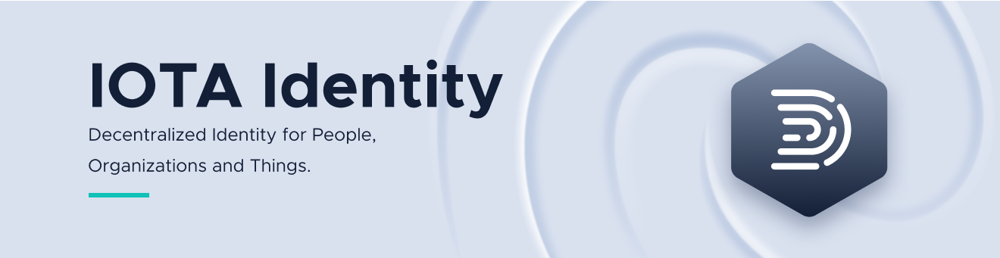

## IOTA Identity Examples

This folder provides code examples for you to learn how IOTA Identity can be used.

You can run each example using

```rust
cargo run --example <example_name>
```

For Instance, to run the example `getting_started`, use

```rust
cargo run --example getting_started
```

The following examples are avaliable for using the basic account (A high level API):

| # | Name | Information |
| :--: | :----------------------------------------------------- | :------------------------------------------------------------------------------------------------------------------------- |
| 1 | [getting_started](./getting_started.rs) | Introductory example for you to test whether the library is set up / working properly and compiles.                        |
| 2 | [account_basic](./account/basic.rs) | A basic example that generates and publishes a DID Document, the fundamental building block for decentralized identity.    |
| 3 | [account_config](./account/config.rs) | This example goes into more detail regarding the useage of DID Documents. |
| 4 | [account_methods](./account/methods.rs) | A basic example that generates and publishes subject and issuer DID Documents, then creates a Verifiable Credential (vc) specifying claims about the subject, and retrieves information through the CredentialValidator API. |
| 5 | [account_services](./account/services.rs) | This example explains how to create a Verifiable Presentation from a set of credentials and sign it. |
| 6 | [account_signing](./account/signing.rs) | A basic example that generates a DID Document, publishes it to the Tangle, and retrieves information through DID Document resolution/dereferencing. |
| 7 | [account_stronghold](./account/stronghold.rs) | An example that utilizes a diff and integration chain to publish updates to a DID Document. |


The following examples are avaliable for using the low-level APIs, which provides more flexibility at the cost of complexity:

| # | Name | Information |
| :--: | :----------------------------------------------------- | :------------------------------------------------------------------------------------------------------------------------- |
| 1 | [low_create_did](./low-level-api/create_did.rs) | A basic example that generates and publishes a DID Document, the fundamental building block for decentralized identity. |
| 2 | [low_manipulate_did](./low-level-api/manipulate_did.rs) | This example goes into more detail regarding the usage of DID Documents. |
| 3 | [low_verifiable_credential](./low-level-api/create_vc.rs) | A basic example that generates and publishes subject and issuer DID Documents, then creates a Verifiable Credential (vc) specifying claims about the subject, and retrieves information through the CredentialValidator API. |
| 4 | [low_verifiable_presentation](./low-level-api/create_vp.rs) | This example explains how to create a Verifiable Presentation from a set of credentials and sign it. |
| 5 | [low_resolution](./low-level-api/resolution.rs) | A basic example that generates a DID Document, publishes it to the Tangle, and retrieves information through DID Document resolution/dereferencing. |
| 6 | [low_diff_chain](./low-level-api/diff_chain.rs) | An example that utilizes a diff and integration chain to publish updates to a DID Document. |
| 7 | [low_merkle_key](./low-level-api/merkle_key.rs) | An example that revokes a key and shows how verification fails as a consequence. |
